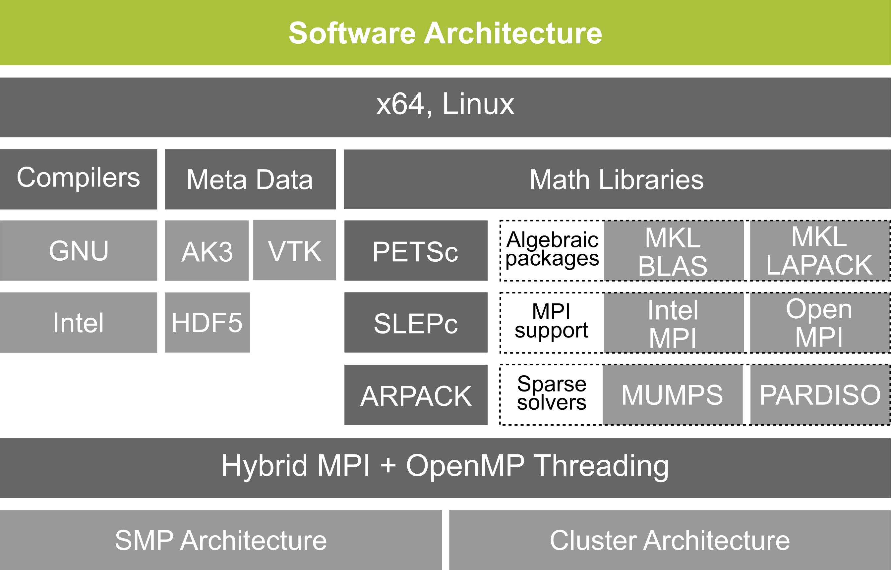

# Research code elPaSo

The research code “Elementary Parallel Solver (elPaSo)” is the in-house vibroacoustic simulation tool constantly developed over 25 years at TU Braunschweig, presently extended and maintained by the Institute for Acoustics (InA), TU Braunschweig.

```{image} ../images/elPaSo_InA2021.png
:width: 400px
:align: center
```

The tool is used extensively for research and teaching for many years. The whole elPaSo project includes the core software written in C++ and other assisting in-house tools written in python. elPaSo offers a wide range of features (see Features and Capability) and facilitates efficient computations in HPC clusters to support parallel computing of large-scale high-fidelity vibroacoustic models. Moreover, the project is built on a flexible and modular framework to support new research features and potential collaborations. Interested? Please get in touch with us for more information.

::::{grid}
:gutter: 3

:::{grid-item-card}
[<b>Tutorials</b>](../tutorials/tutorials.md)
:::

:::{grid-item-card} 
[<b>User Guide</b>](../theory/utility.md)
:::

:::{grid-item-card} 
[<b>Developer Documenation</b>](../technical/technical.md)
:::

::::

```{dropdown}  Features and Capabilities

### Vibroacoustic solver for FEM, BEM and SBFEM
The capabilities of the tool include acoustic and structural analysis using the popular numerical methods of FEM, BEM and SBFEM supporting various complex material and element types. The solver is suitable for acoustic and structural analysis for static analysis, modal analysis, time domain analysis and frequency domain analysis. Various applied fields with elPaSo are building acoustics, geometric optimizations, wave propagation, soil-structure interactions and fluid-structure interaction.

### Uncertainty quantification
elPaSo enables non-intrusive parametric uncertainty quantification (UQ). This capability allows the use of elPaSo as a black-box to obtain the system response associated with each realisation of random vector and UQ is performed as an extension of the deterministic analysis of the model. Also, the possibility to parallelize the elPaSo code in this approach provides an added advantage. These characteristics make the elPaSo solver very attractive for parametric uncertainty quantification in complex models and industrial applications.

### Model order reduction
elPaSo provides methods to perform model order reduction in both frequency and parameter domain. As a result, computations can be performed faster in a reduced space without compromising on accuracy. The methods are constantly developed and improved for handling large-scale vibroacoustics models.

### Code sustainability
elPaSo ensures code sustainability developed as a part of the DFG project SURESOFT. This includes continuous integration, software testing, containerization and bug reporting. Software-testing concepts in the development workflow incorporating unit-, integration- and performance testing are also adapted within the code. Best practices to facilitate detailed code documentation, both technical and usage, is underway.

### Efficient deployment
In order take advantage of the available computational resources, parallel computing has been enabled with MPI and OMP parallelization. elPaSo uses state-of-the-art mathematical routines provided from Intel Math Kernel Library for basic LAPACK and BLAS operations, and PETSc, SLEPc, ARPACK for advanced scientific computations. A wide of direct, iterative and eigen solvers assists the solution process for various analysis types which includes MUMPS, PARDISO and GMRES. The tool is successfully deployed in the TU Braunschweig Phoenix cluster and is used since many years for large-scale computations.



### Supporting tools and interfaces

The supporting tools of elPaSo includes sub-projects supporting pre and post processing of simulation data, visualization and advanced computational wrappings. The tools offered are formulated in the following table.

1. <b>elPaSo Pre-processor Tool</b>: Provides modelling features of material modelling, loading types, boundary conditions, conforming and non-conforming coupling interfaces, and many more.
1. <b>elPaSo Post-processor/Analysis Tool</b>: Provides a range of post-processing routines to compute the interested acoustic quantity and routines for visualizing the obtained results. The tool associates with methods to visualize measurement data and routines to perform data fitting.
1. <b>elPaSo Py-AcMoRe</b> (Python module for faster training and evaluation of vibroacoustics systems using model order reduction): Provides model order reduction functionalities for faster computations in frequency and parametric domain

In addition to the above-mentioned in-house tools, elPaSo is open to interface with external softwares. Currently, the code interfaces to commercial softwares of Coreform Cubit and ABAQUS.
```

```{dropdown} Usage, Contributions and Collaborations 

Usage and contributions to the project are highly welcome. Please contact us for further information. Also, we offer the master specialization course “[Computational Acoustics](https://www.tu-braunschweig.de/en/ina/teaching/courses/computational-acoustics)” in summer semester, which associates elPaSo for teaching in terms of both usage and development.

```


```{dropdown} Authors

Sabine C. Langer, Dirk Clasen, Marco Schauer, Silja Beck, Lutz Ackermann, Katherina Rurkowska, Meike Wulkau, Christopher Blech, Sebastian Rothe, Tobias Ring, Mathias Dorn, Shreyas Guruprasad, Harikrishnan K. Sreekumar, Yannik Hüpel
```

```{dropdown}   Publications

Key publications associated with elPaSo project:
- M. Schauer, J. E. Roman, E. S. Quintana-Ort´ı, and S. Langer, “Parallel computation of 3-d soil-structure interaction in time domain with a coupled fem/sbfem approach,” Journal of Scientific Computing, vol. 52, pp. 446–467, 2012. [Online]. Available: https://doi.org/10.1007/s10915-011-9551-x
- C. Blech, C. K. Appel, R. Ewert, J. W. Delfs, and S. C. Langer, “Numerical prediction of passenger cabin noise due to jet noise by an ultra–high–bypass ratio engine,” Journal of Sound and Vibration, vol. 464, p. 114960, 2020. [Online]. Available: https://www.sciencedirect.com/science/article/pii/S0022460X1930522X 
- H. K. Sreekumar, C. Blech, and S. C. Langer, “Large-scale vibroacoustic simulations using parallel direct solvers for high-performance clusters,” in Proceedings of the Annual Conference on Acoustics. DAGA, 2021, pp. 864–867.

More publications can be found in [here](https://www.tu-braunschweig.de/ina/forschung/publikationen).

```

```{dropdown}   Contact and Support
(contact-us)=

For support please contact us via email at ina(at)tu-braunschweig.de or the contact person for elPaSo:

<b>Harikrishnan Sreekumar, MSc. </b> <br>
hk.sreekumar(at)tu-braunschweig.de<br><br>
Technische Universität Braunschweig <br>
Institut für Akustik | Institute for Acoustics <br>
Langer Kamp 19, Raum 201 | Room 201 <br>
38106 Braunschweig <br>
Germany

```