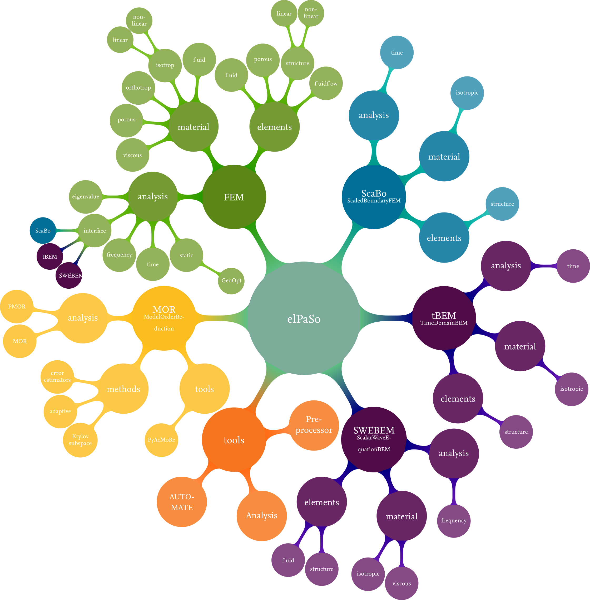

# Markdown cheat sheet

[Jupyterbook documentation](https://jupyterbook.org/en/stable/intro.html)

## Badges
{bdg-primary}`required | elPaSo Core Module` 
{bdg-secondary}`optional | elPaSo Research Module`

{bdg-secondary}`stable | PETSc 3.16.1`

{bdg-info}`keywords` {bdg-info-line}`Beginner` {bdg-info-line}`FEM` {bdg-info-line}`DSG4` {bdg-info-line}`Plate`

Other badges: https://github.com/executablebooks/sphinx-design/blob/main/docs/badges_buttons.md

## Tables
| **Head**                  | **Head** | **Head**               | **Head**         | **Head** |
|---------------------------|:--------:|:-----------------------|:-----------------|:--------:|
| a                         | b        | c                      | d                | e        |

(internal-reference)=
## Text formatting

`highlighted`
**bold**
*italics*
Line break <br/>
<tt>typewriter</tt>

## Lists
1. List A<br/>
    1. List B
    1. List B
1. List A
1. List A
    - List C
    - List C

## URL
[Link](example.com)
[Internal URL](./main/intro.md)
[Internal reference to section](internal-reference)

## Code environment

```bash
sbatch example_job_file.job
```

```python
import numpy as np
```

```cpp
std::vector<int> _vector;
```

## Boxes

```{note}
Under construction. Content will be available soon.
```

```{note}
A note
```

```{warning}
A warning
```

## Figures

```{image} ./images/elPaSo_InA2021.png
:width: 400px
:align: center
```



Preffered:


## Emojis

https://gist.github.com/rxaviers/7360908

## Table of contents

```{tableofcontents}
```
