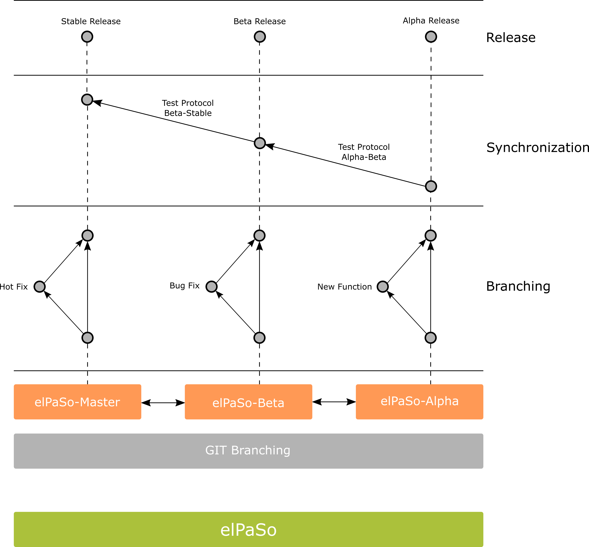

# Contributing

You are welcome to contribute to the project. Please create a new development branch with name `alpha-<YOUR_FEATURENAME>` (see git branching strategy illustration below) and push your commits. Finally, create a merge request to branch "beta" when your feature is ready to be integrated. We encourage you to merge a stable version of your feature regularly to avoid incompatibility issues.

## Git branching strategy

## What can you contribute?

If you are willing to contribute, an option is to see our `Issue Board` in the GitLab repository. Feel free to [contact us](contact-us) to share your wonderful ideas.