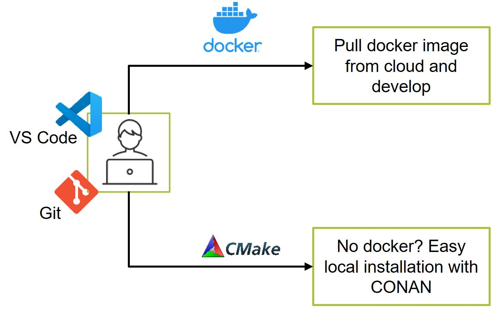

# Development setup

elPaSo is `ready to develop`.

## Develop in container

With VS Code and a Docker service, you can open the source code from the elPaSo git repository within a container that includes everything to build elPaSo. The file `.devcontainer/devcontainer.json` contain the necessary setting for VS Code. You are prompted by VS code whether to open in a container. Follow rest of the steps in [Installation Guide](../tutorials/installation/install_executable.md) to build elPaSo.

## Develop with local installations

Refer to [Installation Guide](../tutorials/installation/install_executable.md) and [External Dependencies](./sustainability/maintainance/maintaining_libraries.md).