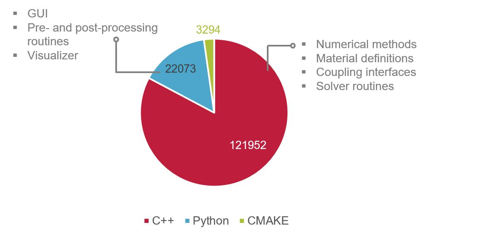
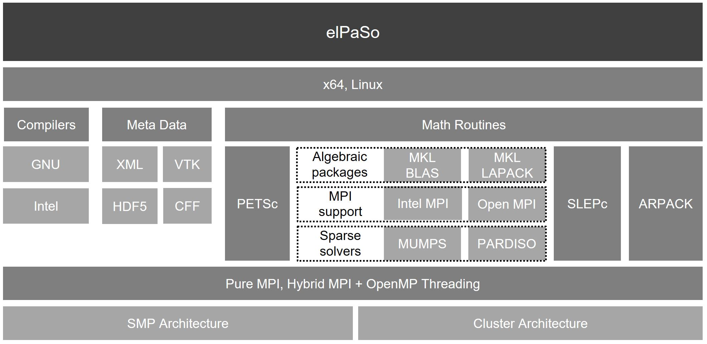

# Developer guide

Welcome to the Developer Guide! Happy to have you onboard and your contribution to improve elPaSo.

The developer circle of elPaSo include the internal researchers and collaborators of the Institute for Acoustics, students and external volunteers. elPaSo-Core is free software: you can redistribute it and/or modify it under the terms of the GNU Lesser General Public License as published by the Free Software Foundation, either version 3 of the License, or (at your option) any later version.

elPaSo strives to adhere to the best programming practices like clean code, sustainable research code and efficient software design. Therefore, we encourage the developers to continue this saga.

## Development timeline of elPaSo

As a motivation, elPaSo has a long legacy since 1996. Become a part of it! Following are the important milestones:
|               |               |
|---------------|---------------|
| 1996         | Founded with FEM-BEM coupling 1 |
| 1997          | BEM development and implementation 1  [H. Antes (1998)]|
| 1997         | Starting point FEM 1 [S. C. Langer, H. Antes (2003)] |
| 2006         | Starting point SBFEM  1 [L. Lehmann, S. C. Langer, D. Clasen (2006)] |
| 2009         | Communication tools enabled for parallel computations  1 [M. Schauer et al. (2011)] |
| 2014         | Modeling of flow-induced sound in porous materials 1 [S. C. Beck, S. C. Langer (2014)] |
| 2016         | Uncertainty quantification and sensitivity analysis routines 2 |
| 2019         | Performance optimizations with hybrid parallelization  3 [H. K. Sreekumar, C. Blech, S. C. Langer (2021)]|
| 2020         | Adapting the fast HDF5 binary file-system 3 |
| 2020         | SURESOFT framework: Development of CI/CD framework, automated testing 3 [H. K. Sreekumar, C. Blech, S. C. Langer (2023)] |
| 2021         | Starting point MOR  3 |
| 2021         | Fluid structure coupling for non-conforming meshes  3 |
| 2022         | Starting point parametric MOR  3 [H. K. Sreekumar et al. (2022,2023)] |
| 2023         | Efficient solving strategies for aircraft cabin noise assessment  3 [C. Blech, H. K. Sreekumar, Y. Hüpel, S. C. Langer (2023)] |

1 TU Braunschweig, Institut für Angewandte Mechanik  
2 TU Braunschweig, Institut für Konstruktionstechnik  
3 TU Braunschweig, Institut für Akustik

## Source code

Major amount of source code that belong to the elPaSo solver itself is coded in `C++`. However, elPaSo supporting tools that performs various tasks that includes the pre-/post-visualizing tool, model order reduction toolkit are coded in `python`.

## Architecture

elPaSo development is targetted towards linux systems so as to finally perform efficient simulations on HPC platforms. The software architecture is depicted in the figure below:

## How to Contribute?

You are welcome to contribute to the project. See [Contributing](./contributing.md) for details.

## Maintainance Guide

See documentation on maintaining different entities of elPaSo in [Maintaining](./sustainability/maintainance/maintaining.md).