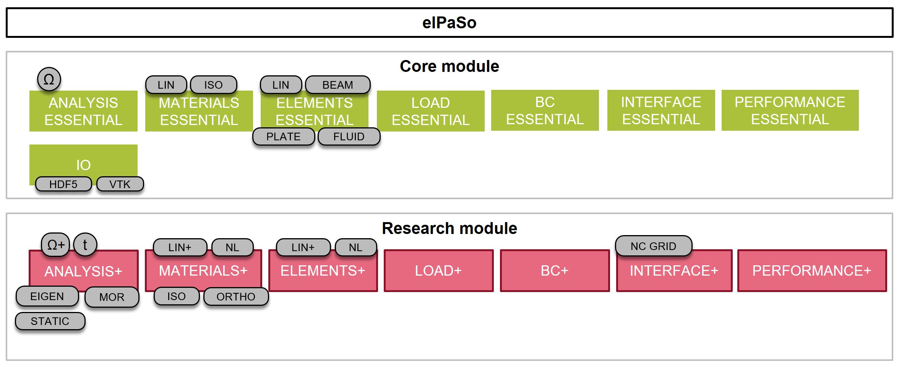

# Feature overview

Following summarizes an overview of components included in the open-source eCore module and what are close withing eResearch module. `Do you see something interesting in eResearch and want to use?`. Contact us and we will try to include them in eCore module.

## FEM components in elPaSo

The main components constituiting the eCore project are described here.

### Analysis types
| **Functionality**                               | **Identifier**  | **elPaSo Core** | **elPaSo Research** |
|-------------------------------------------------|-----------------|:-----------------:|:---------------------:|
| Basic frequency domain steady state analysis    | frequency-basic | $\checkmark$    |                     |
| Advanced frequency domain steady state analysis | frequency       |                 | $\checkmark$        |
| Time domain analysis                            | time            |                 | $\checkmark$        |
| Static analysis                                 | static          |                 | $\checkmark$        |
| Geometrical optimization                        | geoopt          |                 | $\checkmark$        |
| Eigenvalue analysis                             | eigen           |                 | $\checkmark$        |
| Model order reduction                           | mor-offline     |                 | $\checkmark$        |

### Element types
| **Identifier**     | **elPaSo Core** | **elPaSo Research** |
|------------------|:---------------:|:-------------------:|
| BeamBernoulli      | $\checkmark$    |                     |
| BeamTimoshenko     | $\checkmark$    |                     |
| BeamBernoulli10    | $\checkmark$    |                     |
| BeamTimoshenko10   | $\checkmark$    |                     |
| BeamBernoulli12    | $\checkmark$    |                     |
| BeamTimoshenko12   | $\checkmark$    |                     |
| BeamBernoulli10nl  |                 | $\checkmark$        |
| BeamTimoshenko10nl |                 | $\checkmark$        |
| Brick8             | $\checkmark$    |                     |
| Brick20            |                 | $\checkmark$        |
| Brick27            |                 | $\checkmark$        |
| Kirch4             | $\checkmark$    |                     |
| DSG3               |                 | $\checkmark$        |
| DSG4               | $\checkmark$    |                     |
| DSG9               |                 | $\checkmark$        |
| DSG9pre            |                 | $\checkmark$        |
| Disc3              |                 | $\checkmark$        |
| Disc4              | $\checkmark$    |                     |
| Disc9              |                 | $\checkmark$        |
| Disc9s             |                 | $\checkmark$        |
| DiscDr4            |                 | $\checkmark$        |
| PlShell3           |                 | $\checkmark$        |
| PlShell4           |                 | $\checkmark$        |
| PlShell9           |                 | $\checkmark$        |
| PlShell9pre        |                 | $\checkmark$        |
| PlShellDr4         |                 | $\checkmark$        |
| Tetra4             |                 | $\checkmark$        |
| Tetra10            |                 | $\checkmark$        |
| Tetra4L            |                 | $\checkmark$        |
| Tetra10L           |                 | $\checkmark$        |
| Tetra16            |                 | $\checkmark$        |
| Tetra16L           |                 | $\checkmark$        |
| Spring             | $\checkmark$    |                     |
| Springz            | $\checkmark$    |                     |
| SpringBC           | $\checkmark$    |                     |
| SpringBCx          | $\checkmark$    |                     |
| SpringBCy          | $\checkmark$    |                     |
| SpringBCz          | $\checkmark$    |                     |
| SpringBCrx         | $\checkmark$    |                     |
| SpringBCry         | $\checkmark$    |                     |
| SpringBCrz         | $\checkmark$    |                     |
| Pointmass          | $\checkmark$    |                     |
| Cable2D            |                 | $\checkmark$        |
| Cable3D            |                 | $\checkmark$        |
| PoroPlateQ2P1      |                 | $\checkmark$        |
| PoroPlateQ2P2      |                 | $\checkmark$        |
| PoroPlateQ2P3      |                 | $\checkmark$        |
| PoroPlateQ3P1      |                 | $\checkmark$        |
| PoroPlateQ3P3      |                 | $\checkmark$        |
| DiscPQ2P1          |                 | $\checkmark$        |
| ShellQ2P1          |                 | $\checkmark$        |
| PoroPlateKienzler4 |                 | $\checkmark$        |
| PoroDiscKienzler4  |                 | $\checkmark$        |
| PoroShellKienzler4 |                 | $\checkmark$        |
| Poro3dUP8          |                 | $\checkmark$        |
| Poro3dUP27         |                 | $\checkmark$        |
| Poro3dUU8          |                 | $\checkmark$        |
| Fluid4             |                 | $\checkmark$        |
| Fluid8             | $\checkmark$    |                     |
| Fluid27            |                 | $\checkmark$        |
| Fluid2d4           |                 | $\checkmark$        |
| Fluid2d9           |                 | $\checkmark$        |
| FF4                |                 | $\checkmark$        |
| FF9                |                 | $\checkmark$        |

(Material_types)=
### Material types
Elpaso is capable of implementing different material models for acoustical simulations. For
example: orthotropic, isotropic, fluid, spring, etc. Each material has its own behavior and
characteristics, each of them being described within the syntax against the respective property
values. See Table \ref{tab:MaterialTypes} for an overview of material types offered in eCore.

| **Functionality**                                                                                          | **Identifier**                    | **elPaSo Core** | **elPaSo Research** |
|----------------------------------------------------------------------------------------------------------|---------------------------------|:-----------------------------------:|:---------------------------------------:|
| Linear elastic isotropic                                                                                   | STR\_LIN\_ELA\_ISO\_DIR           | $\checkmark$                        |                                         |
| Linear viscoelastic isotropic                                                                              | STR\_LIN\_VIS\_ISO\_DIR           | $\checkmark$                        |                                         |
| Non-linear elastic isotropic                                                                               | STR\_NL\_ELA\_ISO\_DIR            |                                     | $\checkmark$                            |
| Linear viscoelastic isotropic   implementing Cremer/Heckl constrained layer damping (CLD) model            | STR\_LIN\_VIS\_ISO\_CLDCH         |                                     | $\checkmark$                            |
| Linear viscoelastic isotropic   implementing Ross/Kerwin/Ungar (RKU) constrained layer damping (CLD) model | STR\_LIN\_VIS\_ISO\_CLDRKU        |                                     | $\checkmark$                            |
| Linear viscoelastic isotropic   implementing RKU CLD and laminate theory                                   | STR\_LIN\_VIS\_ISO\_CLDRKU\_LAMWA |                                     | $\checkmark$                            |
| Linear elastic orthotropic                                                                                 | STR\_LIN\_ELA\_ORT\_DIR           |                                     | $\checkmark$                            |
| Linear viscoelastic orthotropic                                                                            | STR\_LIN\_VIS\_ORT\_DIR           |                                     | $\checkmark$                            |
| Linear viscoelastic orthotropic laminate                                                                   | STR\_LIN\_VIS\_ORT\_LAM\_NOPRE    |                                     | $\checkmark$                            |
| Linear viscoelastic orthotropic laminate   prestressed                                                     | STR\_LIN\_VIS\_ORT\_LAM           |                                     | $\checkmark$                            |
| Linear spring orthotropic                                                                                  | STR\_LIN\_SPR\_ORT\_DIR           | $\checkmark$                        |                                         |
| Point mass                                                                                                 | STR\_LIN\_POINTMASS               | $\checkmark$                        |                                         |
| Linear acoustic fluid undamped                                                                             | AF\_LIN\_UAF\_ISO\_DIR            | $\checkmark$                        |                                         |
| Linear acoustic fluid damped                                                                               | AF\_LIN\_EQF\_ISO\_DIR            |                                     | $\checkmark$                            |
| Linear acoustic fluid lossy                                                                                | AF\_LIN\_VIS\_LF\_DIR             |                                     | $\checkmark$                            |
| Linear acoustic fluid to treat porous   media                                                              | AF\_LIN\_VIS\_ISO\_POROUS         |                                     | $\checkmark$                            |
| Linear acoustic cloaking fluid                                                                             | AF\_LIN\_CLK\_AISO\_DIR           |                                     | $\checkmark$                            |
| Linear poroelastic                                                                                         | STR\_LIN\_ELA\_POR\_DIR           |                                     | $\checkmark$                            |
| Linear poroelastic for plate elements   based on Biot's theory                                             | STR\_LIN\_ELA\_POR\_PLATE         |                                     | $\checkmark$                            |
| Linear poroelastic for foams                                                                               | STR\_LIN\_ELA\_POR\_FOAM          |                                     | $\checkmark$                            |
| Linear poroelastic 3D elements based on   Biot's theory                                                    | STR\_LIN\_ELA\_POR\_3D            |                                     | $\checkmark$                            |
| Linear poroelastic 3D elements with loss                                                                   | STR\_LIN\_VIS\_POR\_3D            |                                     | $\checkmark$                            |
| Linear poroelastic 3D elements with loss   and compression modulus                                         | STR\_LIN\_VIS\_POR\_3DCOMP        |                                     | $\checkmark$                            |
| Linear poroelastic 3D elements trans                                                                       | STR\_LIN\_ELA\_POR\_3DTRANS       |                                     | $\checkmark$                            |
| Non-linear elasticplastic cap model                                                                        | STR\_NL\_ELPLA\_ISO\_CM           |                                     | $\checkmark$                            |
| Non-linear elasticplastic cap model with   outer adjustment                                                | STR\_NL\_ELPLA\_ISO\_CMO          |                                     | $\checkmark$                            |
| Non-linear elasticplastic Drucker Prager   parameters                                                      | STR\_NL\_ELPLA\_ISO\_DP           |                                     | $\checkmark$                            |
| Non-linear elasticplastic Drucker Prager   parameters ideal plastic                                        | STR\_NL\_ELPLA\_ISO\_DPIP         |                                     | $\checkmark$                            |
| Non-linear elasticplastic Drucker Prager   parameters with outer adjustment                                | STR\_NL\_ELPLA\_ISO\_DPO          |                                     | $\checkmark$                            |
| Non-linear elasticplastic Drucker Prager   parameters with outer adjustment ideal plastic                  | STR\_NL\_ELPLA\_ISO\_DPOIP        |                                     | $\checkmark$                            |

### Load types

| **Functionality**                                                      | **Identifier**             | **elPaSo Core** | **elPaSo Research** |
|----------------------------------------------------------------------|--------------------------|:-----------------------------------:|:---------------------------------------:|
| Force/moment on a node                                                 | point\_force               | $\checkmark$                        |                                         |
| Force/moment on a node - time dependent                                | structuretime              |                                     | $\checkmark$                            |
| Sound source at a fluid node                                           | fluid                      | $\checkmark$                        |                                         |
| Frequency dependent element loads                                      | plane\_wave                |                                     | $\checkmark$                            |
| Frequency dependent element loads TBL                                  | turbulent\_boundary\_layer |                                     | $\checkmark$                            |
| Normal velocity vn or flux q acting normal to surface of fluid element | v\_n                       |                                     | $\checkmark$                            |

### Boundary conditions

| **Functionality**                             | **Identifier** | **elPaSo Core** | **elPaSo Research** |
|---------------------------------------------|--------------|:-----------------------------------:|:---------------------------------------:|
| Structural nodal constraints                  | structural     | $\checkmark$                        |                                         |
| Acoustic nodal constraints                    | acoustic       | $\checkmark$                        |                                         |
| Acoustic nodal constraints, oblique incidence | fluidoblique   |                                     | $\checkmark$                            |

### Coupling interfaces

| **Identifier**              | **elPaSo Core** | **elPaSo Research** |
|-----------------------------|:-----------------------------------:|:---------------------------------------:|
| InterfaceBeam               | $\checkmark$                        |                                         |
| InterfaceFFPoro3dUP         |                                     | $\checkmark$                            |
| InterfaceFFShell            |                                     | $\checkmark$                            |
| InterfaceKirchhoff          | $\checkmark$                        |                                         |
| InterfaceMindlin            | $\checkmark$                        |                                         |
| InterfaceMindlinEquiporo    |                                     | $\checkmark$                            |
| InterfaceMindlinPoro3dUP    |                                     | $\checkmark$                            |
| InterfacePlaneShellPoro2dUP |                                     | $\checkmark$                            |
| MultiPointConstraint        |                                     | $\checkmark$                            |
| NCInterfaceMindlin          |                                     | $\checkmark$                            |
| NCInterfaceMindlinEquiporo  |                                     | $\checkmark$                            |
