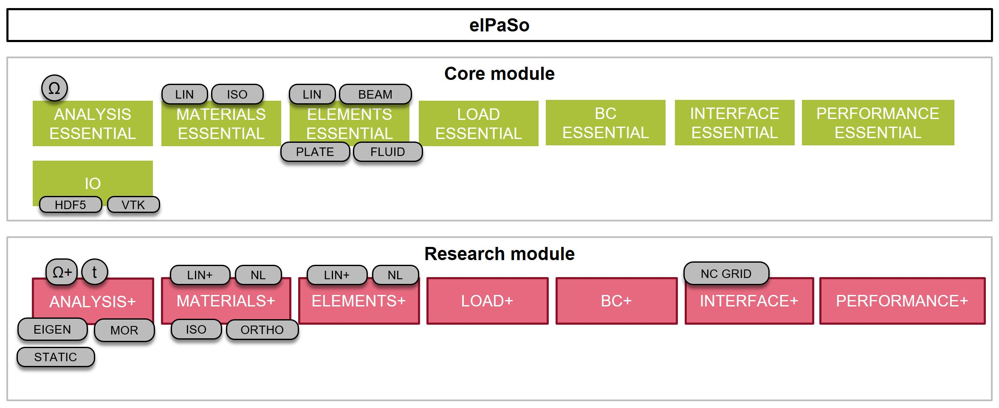

# Finite element method

In the field of acoustics, the Finite Element Method (FEM) is a popular tool for vibration analysis of structures through modelling the structure-borne sound propagation. Another application of the numerical method is to model the propagation of sound in air (fluid) medium, also termed as air-borne sound. The current chapter deals with the background theory of the FEM, the application of FEM techniques for modelling sound propagation in structures and fluids, and finally their coupling to deal with fluid-structure interaction.

