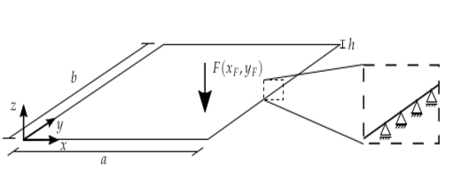
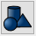
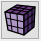
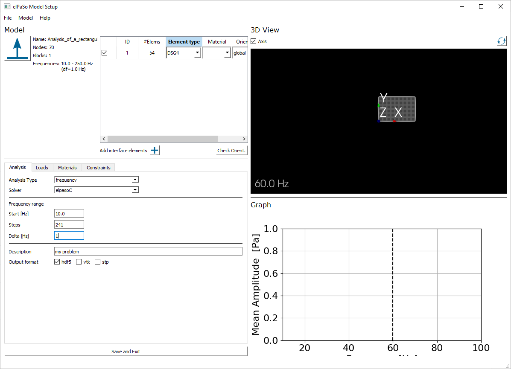
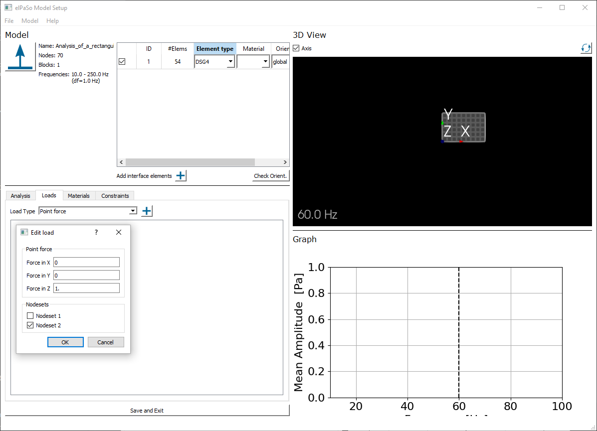
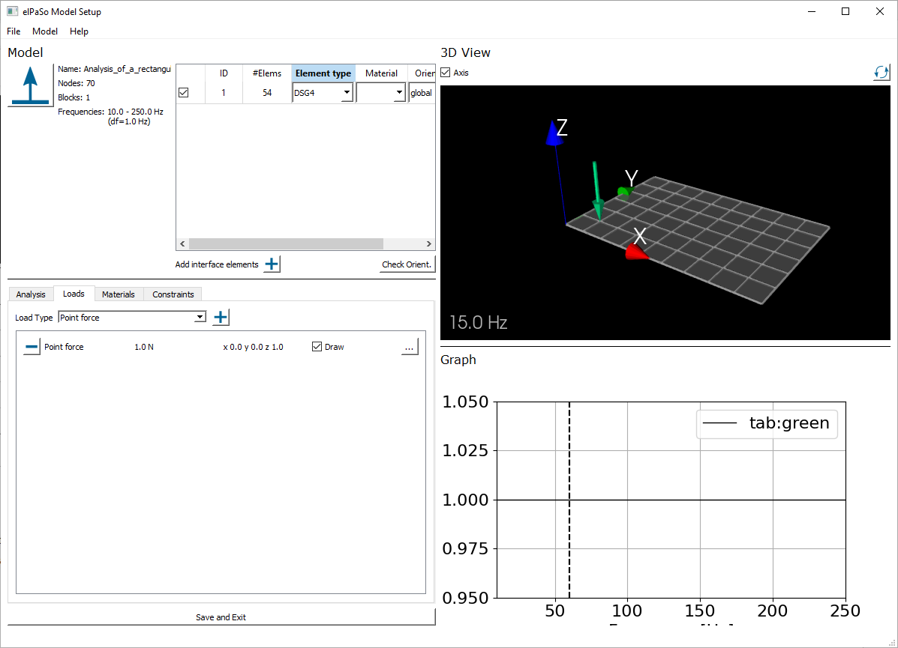
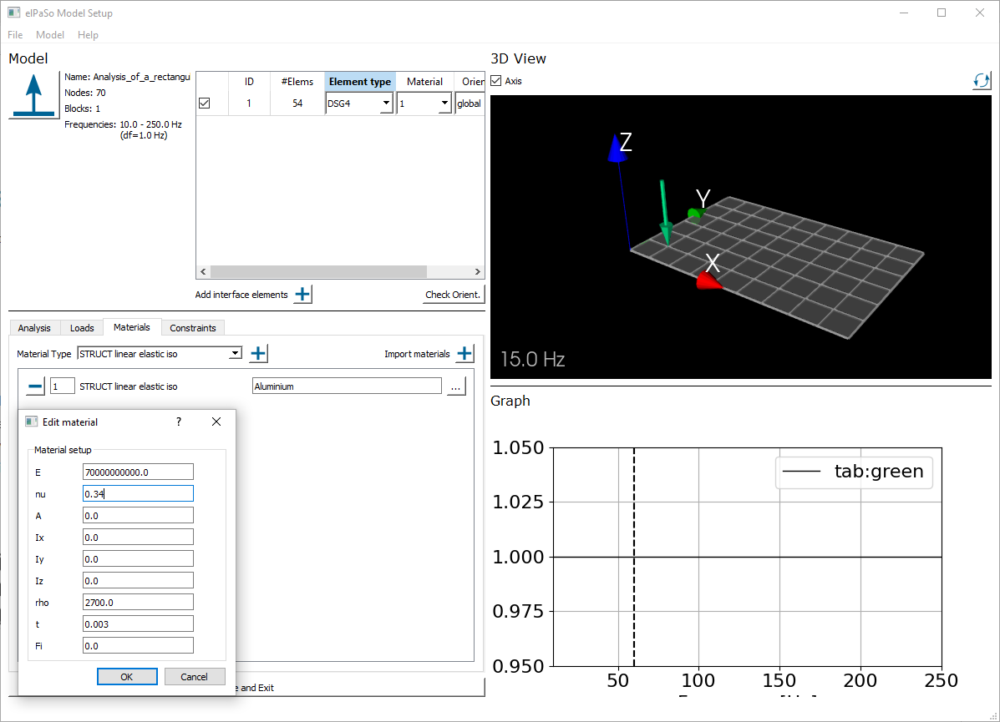
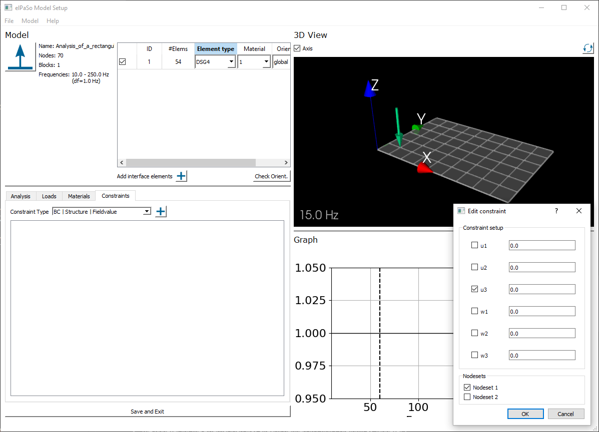
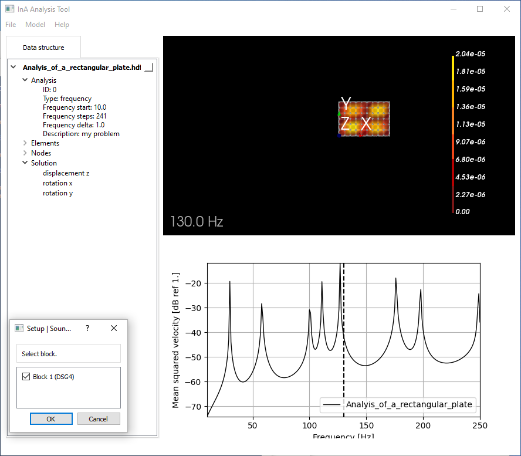

# Analysis of a Rectangular Plate
{bdg-primary}`required | Coreform Cubit` {bdg-primary}`required | elPaSo Pre-/Post-processor` {bdg-primary}`required | elPaSo Core Module` 
{bdg-secondary}`optional | elPaSo Research Module`

{bdg-info}`keywords` {bdg-info-line}`Beginner` {bdg-info-line}`FEM` {bdg-info-line}`DSG4` {bdg-info-line}`Plate` {bdg-info-line}`Frequency-domain`

## Objective
The objective of this tutorial is to model a simply supported plate made of aluminium (a linear elastic isotropic material), as shown in the figure below, and model its response in frequency domain when excited by a single point force with the data given in the table below. Also to visualize the results and save the FRF (frequency response function) for the mean squared velocity. 





|    Parameter          |   Symbol      |  Value                |
| :------------         | ------------- | :-------------        |
|Side edge length       |$\text{a}   $  |$0.9 \text{ m } $      | 
|Side edge length       |$\text{b}  $   |$0.6 \text{ m }  $     |
|Thickness              |$\text{h} $    |$0.003 \text{ m }  $   |
|Force                  |$\text{F }$    |$1 \text{ N }  $       |
|Force location in x    |$x_{F}$        |$0.1 \text{ m } $      |
|Force location in y    |$y_{F}$        |$0.1 \text{ m }  $     |
|Density                |$ρ$            |$2700$ $kg/m^3$        |
|Young’s modulus        |$\text{E}  $   |$7e10$ $N/m^2 $        |
|Poisson’s ratio        |$\text{ν} $    |$0.34$                 |
|frequency range        |$\text{f}  $   |$10 − 250 \text{ Hz} $ |
|frequency step         |$∆\text{f} $   |$1 \text{ Hz}$         |


----

## Procedure 
As already described in the general overview, the typical steps to model an acoustic problem are:
  - Pre-Processing (Cubit Coreform / Abaqus)
  - Solving
  - Post-Processing

A detailed overview of each of the steps is provided in the following sections.

### Pre-Processing
Pre-processing includes all the procedures before Solving. The following sections explain the pre-Processing routine with respect to two different programs:
  - Cubit Coreform and elPaSo Pre-Processor
  - Abaqus

#### Pre-Processing with Cubit Coreform and elPaSo Pre-Processor
This section explains the use of Cubit Coreform and elPaSo Pre-Processor commands required for the pre-Processing routine. The geometry will be setup within Cubit Coreform, while loads, boundary conditions and material parameters will be defined within the elPaSo Pre-Processor. \
The geometry generation in Cubit Coreform can be done in two ways, first is to go by the interface, second is to write a Journal Script in  (or Tools > Journal Editor) and run it at once. The scripting interface is recommended for complex geometries. Both the methods are described in detail in the following sections. \
The Pre-Processing routine can be subdivided into following section: 
  * Modeling of Geometry (in Coreform Cubit)
  * Meshing (in Coreform Cubit)
  * Applying Boundary Conditions (in elPaSo Pre-Processor)
  * Applying External Force (in elPaSo Pre-Processor)
  * Exporting to elPaSo Solver (in elPaSo Pre-Processor)

##### Modeling of Geometry
```{warning} 
Before starting, the working directory has to be set! \
**Follow: Menu Bar > File > Set Directory > <directory_name>** 
```
  * A plate with dimensions $a \times b$ can be created by clicking in the Command Panel on  (Geometry) >  (Create Geometry) >  (Create Surface) >  (Rectangle) > Setting 'Width' (0.9) and 'Height' (0.6) > Specify x-/y-/z-plane (z-plane) > Apply. 
  `````{admonition} Journal Script
  :class: tip
  <tt>#Creating geometry\
  create surface rectangle width 0.9 height 0.6 zplane</tt> 
  `````
  * The user may now move the geometry to set the origin at a defined location by clicking on  (Geometry) >  (Transform Geometry) >  (Transform surfaces) >  (Select 'Move') > Defining 'Surface ID(s)' (1) > Select methods: 'Distance' > Define 'X Distance' (0.45), 'Y Distance' (0.3), 'Z Distance' (0) > Apply.
  `````{admonition} Journal Script
  :class: tip
  <tt>#Move geometry to origin\
  move surface 1 x 0.45 y 0.3 z 0</tt> 
  `````

##### Meshing
* During meshing, the surface is equipped with nodes and elements. This will be realized in the Command Panel by clicking on  (Mesh) >  (Surfaces) >  (Define intervals and sizes) >  (Approximate size) > 'Select surfaces' (1) > 'Approximate size' (0.1) > Apply Size. \
Afterwards, the user can mesh the surface by clicking on 'Mesh'.
```{warning} 
Choose the mesh size in a way that there is at least 6 nodes per bending wavelength.
```
`````{admonition} Journal Script
:class: tip
<tt>#Meshing\
surface 1 size 0.1 \
mesh surface 1</tt>
`````

* To assign element types to the plate model, first, a block has to be created by clicking on  (Analysis Groups and Materials) >  (Blocks) >  (Create material blocks and beams) >  (Create block) > 'Block ID' (1) > 'Select' (Face) > 'ID(s)' (all) > Apply
`````{admonition} Journal Script 
:class: tip
<tt>#Blocks \
block 1 add face all</tt>
`````
* After defining the block, the element type can be defined by clicking on  (Analysis Groups and Materials) >  (Blocks) >  (Assign element type to block) > 'Block ID(s)' (1) > 'Select' (Surfaces) > 'Surfaces' (SHELL4) > Apply
`````{admonition} Journal Script 
:class: tip
<tt>#Assigning element type \
block 1 element type SHELL4</tt>
````` 

##### Create nodesets
* In order to apply external forces and boundary conditions to the plate model in the elPaSo Pre-Processor, nodesets have to be created within Cubit Coreform. 
* First, a nodeset for the boundary conditions will be created by clicking on  (Analysis Groups and Materials) >  (Nodesets) >  (Create nodesets) > 'Nodeset ID' (1) > 'Select' (Curve) > 'ID(s)' (all) > 'Apply'

 

* Second, a nodeset for the external load will be created by clicking on  (Analysis Groups and Materials) >  (Nodesets) >  (Create nodesets) > 'Nodeset ID' (2) > 'Select' (Node) > 'ID(s)' (70) > 'Apply'


`````{admonition} Journal Script 
:class: tip
<tt>#Nodesets \
nodeset 1 add node in curve all \
nodeset 2 add node 70</tt>
````` 
```{warning} 
The Node ID = 70 for the external load can vary in the users program. Please select a node with coordinates $(x_{F},y_{F}) = (0.1,0.1) \text{ m}$
```

##### Export as *.cub5 file
* After creating the geometrical model the user now have to export the specifications to the elPaSo Pre-Processor to proceed with the next Pre-Processing steps. This can be done by clicking in the menu bar on 'File' > 'Save' > 'Data type' (Cubit files(*.cub5)) > Type in a remarkable name > 'Save'

##### Analysis and mesh settings
* Now, the Pre-Processing routine will be continued in the elPaSo Pre-Processor. Therefore, the elPaSo Pre-Processor can be called via the command line:
```bash
python3 <path_to_preprocessor_codes>/main.py
```
* If the elPaSo Pre-Processor is opened, the user needs to load the *cub.5 file, which is intuitively realized in the prompted Explorer-GUI.
* The user needs to select the elPaSo-specific Element type 'DSG4' in 'Element type'.
* Furthermore, the frequency range of the analysis has to be defined as shown in the picture below.



(Ex_1_Ext_F)=
##### External loads
* A Force F = 1N in the z-direction (remember that the geometry is in z-plane) is to be applied at the required node. Keep in mind that you can only define loads that act on nodes!
* The nodeset for the external load was already defined in Cubit Coreform as 'Nodeset 2'



* After creating the external load, the load vector can be displayed by checking on 'Draw'



(Ex_1_Mat)=
##### Material
* The material can be chosen under 'Material Type' (STRUCT linear elastic iso) and added to the model by clicking on  next to 'Material Type' (for further information on material types please refer to the different [material types](Material_types))
* Furthermore, the material can be named (here, Aluminium) as well as defined by its different properties by clicking on  next to 'Aluminium'
```{warning} 
Also the plate's thickness has to be set in 'Edit Material' (here: 0.003)
```

 

(Ex_1_BCs)=
##### Boundary Conditions (BCs)
* Finally, the boundary conditions will be set in 'Constraints' by choosing 'BC | Structure | Fieldvalue' and clicking on 
* Next to this, the constraints have to be set in 'Edit constraint': Here, a simply supported plate is assumed, so that only the translatoric degree of freedom in z-direction is blocked (tick 'u3') (for further information about the elements degrees of freedom please refer to the [element library](Element_library))

 

##### Export as *.hdf5 file
* The export as an *.hdf5 file is realised by clicking on 'Save and Exit'


#### Pre-Processing with Abaqus
```{warning} 
Under construction. Content will be available soon.
```
----

### Solving 
After completing the pre-Processing routine, the user can call elPaSo via the terminal:
```bash
<path_to_elpaso>\elpasoC -c -inp <filename>.hdf5
```
A successful solving would lead to generation of output files (eGenOutput*.hdf5 when for hdf5 output or *.vtk files for vtk output) with the solutions. You may also check the `*.log.0` file for the elPaSo run logs.

### Post-Processing 
After having solved for primary variables, one need to do Post-Processing to calculate derived variables and visualize the results. Post-processing is done for every frequency step and then saved in vtk-legacy format to the working directory. 
* Therefore, the user has to open the elPaSo Post-Processor via the command line:
```bash
python3 <path_to_preprocessor_codes>/mainAnalysis.py
```
* Following this, the user has to load the model into the elPaSo Post-Processor by clicking on 'Model' > 'Load Model' in the Menu Bar
```{warning} 
Please load the initial *.hdf5 file, not the eGenOutput_<filename>.*hdf5 file!
```
* Finally, the user may want to compute the frequency response function for the mean squared velocity by clicking on 'Solution' > right click on 'displacement' > 'Mean Squared Velocity' > tick 'Block 1' > 'OK'



(Ex_1_DSG_comp)=
#### Comparison between modeling with DSG4 and DSG9 elements
The tutorial presented the computations by using DSG4 as element type. Following we present the results obtained by the quadratic variant `DSG9`. Comparing the FRF plots below, the second resolve the wave better and detects more resonance peaks. This is reasoned in the use of DSG9 elements, which possess 9 nodes per elements when compared to 4 nodes per element for DSG4 (see [element library](Element_library)). Therefore, the DSG9 element offers a more accurate modeling of the plate movement due to the extra refinement.

`````{admonition} Notice...
:class: tip
DSG9 elements provide more precise solutions than DSG4 elements!  DSG9 elements are currently only available in the elPaSo Research Module.
`````


----
## Conclusion
An aluminium plate (linear elastic isotropic material) was modeled and its response in frequency domain with regards to the mean squared velocity when excited by a single point force was visualized.
