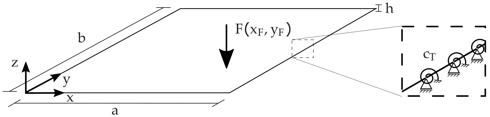
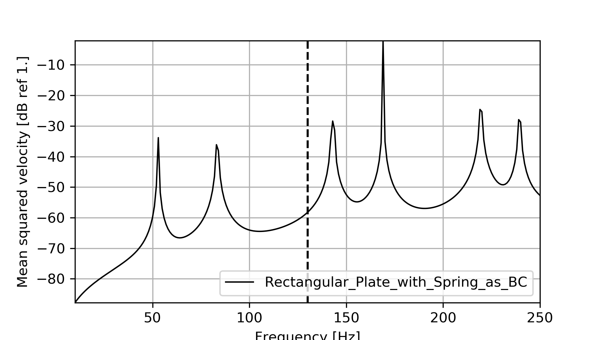
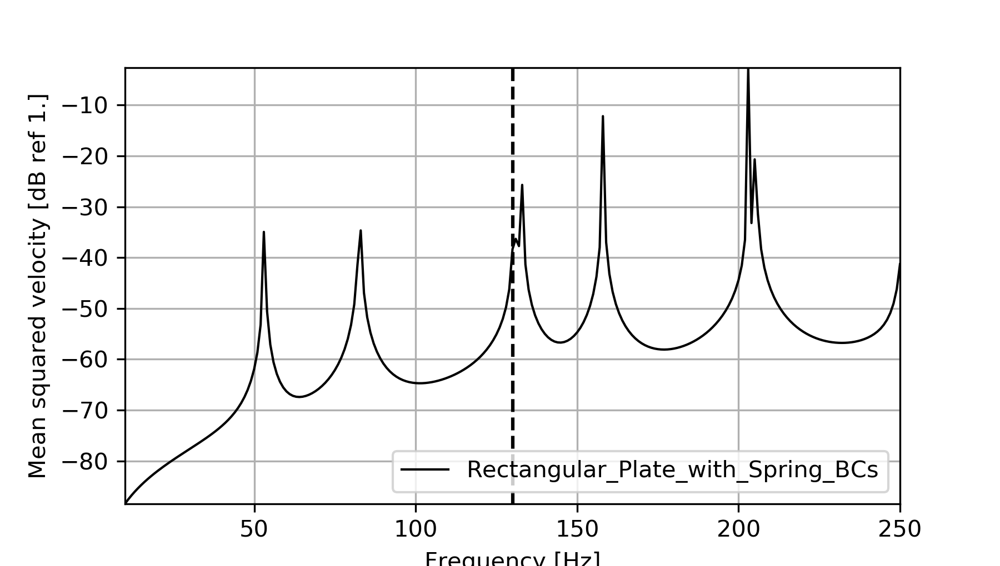
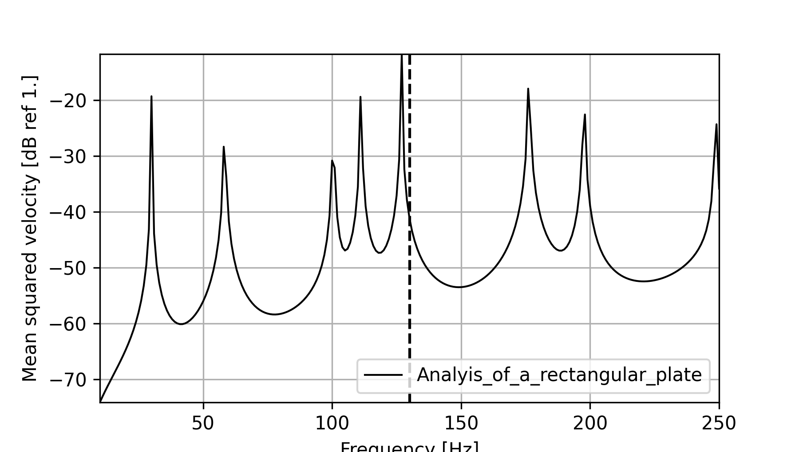
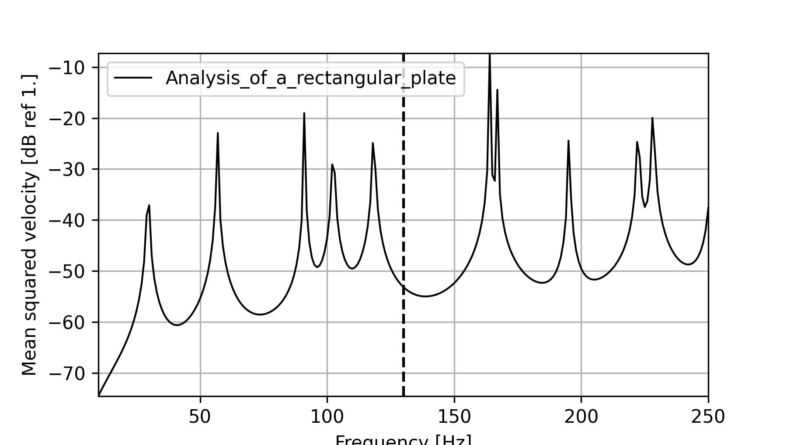
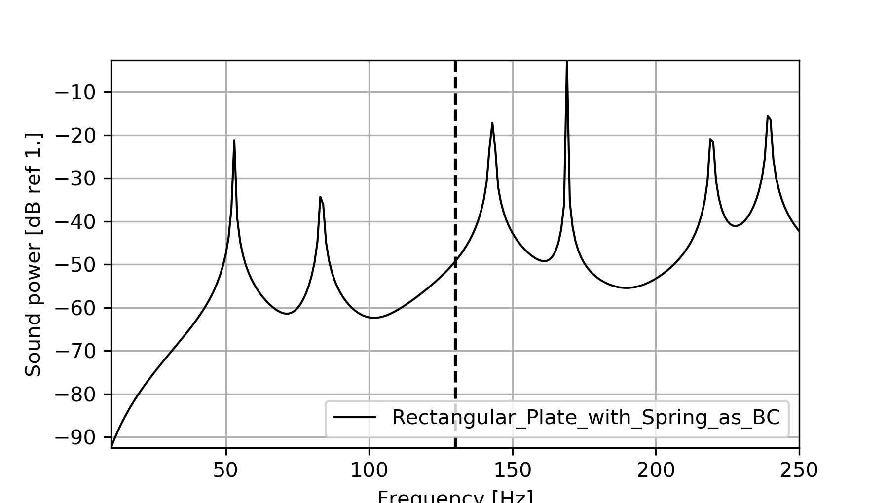
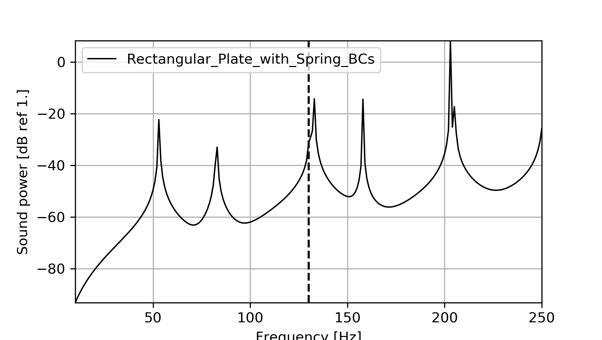

# Rectangular Plate with Spring as BC
{bdg-primary}`required | Coreform Cubit` {bdg-primary}`required | elPaSo Pre-/Post-processor` {bdg-primary}`required | elPaSo Core Module` 
{bdg-secondary}`optional | elPaSo Research Module`

{bdg-info}`keywords` {bdg-info-line}`Beginner` {bdg-info-line}`FEM` {bdg-info-line}`DSG4` {bdg-info-line}`Plate` {bdg-info-line}`Frequency-domain` {bdg-info-line}`Spring BC`

## Objective
The aim of this example is to study the effects of stiffness boundary conditions on acoustic values of the rectangular plate from the previous example, as shown in the figure below. To do so, torsional springs are applied to each node of the boundary with some discrete stiffness. Acoustic values are calculated by use of the Rayleigh integral. The effects of the variation on the mean square velocity and radiated sound power are documented. The table below gives the needed data.



|    Parameter          |   Symbol      |  Value                |
| :------------         | ------------- | :-------------        |
|Side edge length       |$\text{a}   $  |$0.9 \text{ m } $      | 
|Side edge length       |$\text{b}  $   |$0.6 \text{ m }  $     |
|Thickness              |$\text{h} $    |$0.003 \text{ m }  $   |
|Force                  |$\text{F }$    |$1 \text{ N }  $       |
|Force location in x    |$x_{F}$        |$0.1 \text{ m } $      |
|Force location in y    |$y_{F}$        |$0.1 \text{ m }  $     |
|Density                |$ρ$            |$2700$ $kg/m^3$        |
|Young’s modulus        |$\text{E}  $   |$7e10$ $N/m^2 $        |
|Poisson’s ratio        |$\text{ν} $    |$0.34$                 |
|Torsional stiffness    |$c_{T} $       |$1000$ $N/m $          |
|frequency range        |$\text{f}  $   |$10 − 250 \text{ Hz} $ |
|frequency step         |$∆\text{f} $   |$1 \text{ Hz}$         |

----

## Procedure 
In this problem most of the procedure will be similar to what followed for the [first problem](Example_1.md) with some subtle but important changes (which is mainly implementation of boundary conditions).

There are two possibilities to implement a Dirichlet BC in FEM. First, is to fix the displacement at desired position to be zero. In second, assume a spring with very high stiffness such that after calculation the displacement at desired position is approximately zero (and not exactly zero). The displacement value at boundaries depends on the stiffness applied - the higher the stiffness, the closer the displacement at boundaries gets to zero.
The second approach is more plausible with real life scenario as we hardly have zero displacement. Moreover, the joints and other components to which our plate of flange is attached, acts as a spring with some finite stiffness. Now let's have a look into its implementation. 


### Pre-Processing 

#### Pre-Processing with Cubit Coreform and elPaSo Pre-Processor
For this example the modeling procedure in Cubit Coreform is shown only with Journal Script method, for the other approach to create geometry using physical interface please refer to the previous example. One can open the Journal Editor window by clicking onto  to write the script.

#### Modeling of Geometry
* Create the plate with dimensions $a \times b$ ($a=0.9$ and $b = 0.6$)
 `````{admonition} Journal Script
  :class: tip
  <tt>#Creating geometry\
  create surface rectangle width 0.9 height 0.6 zplane</tt> 
  `````

* The user may now move the geometry to set the origin at a defined location 
`````{admonition} Journal Script
  :class: tip
  <tt>#Move geometry to origin\
  move surface 1 x 0.45 y 0.3 z 0</tt> 
  `````

#### Meshing
* During meshing, the surface is equipped with nodes. In doing so, the approximate size of the mesh needs to be defined (here 0.1).
```{warning} 
One should have at least 6 nodes per bending wavelength.
```
`````{admonition} Journal Script
:class: tip
<tt>#Meshing\
surface 1 size 0.1 \
mesh surface 1</tt>
`````

* To assign element types to the plate model, first, a block has to be created.
* After defining the block, the element type can be defined.
* In this section apart from the previous example the script is extended to create two additional blocks where torsional springs have to be deployed. One block contains edge nodes parallel to x-axis whereas the second block contain edge nodes parallel to y-axis. These block are created with the nodes on curves so as to implement spring boundary conditions and apply material as spring later in elPaSo Pre-Processor.

`````{admonition} Journal Script 
:class: tip
<tt>#Blocks and element types \
block 1 add face all \
block 1 element type SHELL4 \
block 2 node in curve 1 3 \
block 3 node in curve 2 4</tt>
`````

Note that the exact element types are later assigned in the elPaSo Pre-processor.

##### Create nodesets
* In order to apply the external force and the support in z-direction as BCs to the plate model in the elPaSo Pre-Processor, two nodesets have to be created within Cubit Coreform.

`````{admonition} Journal Script 
:class: tip
<tt>#Nodesets \
nodeset 1 add node in curve all \
nodeset 2 add node 70</tt>
````` 

The Node ID = 70 for the external load can vary in the users program. Please select a node, which fulfils $x_{F} = y_{F} = 0.1 \text{ m}$

##### Export as *.cub5 file
* After creating the geometrical model the user now have to export the specifications to the elPaSo Pre-Processor to proceed with the next Pre-Processing steps. This can be done by clicking in the menu bar on 'File' > 'Save' > 'Data type' (Cubit files(*.cub5)) > Type in a remarkable name > 'Save'

##### Analysis and mesh settings
* Now, the Pre-Processing routine will be continued in the elPaSo Pre-Processor. Therefore, the elPaSo Pre-Processor can be called via the command line:
```bash
python3 <path_to_preprocessor_codes>/main.py
```
* If the elPaSo Pre-Processor is opened, the user needs to load the *cub.5 file, which is intuitively realized in the upcoming Explorer-GUI.
* The user needs to select the different element types in 'Element type' for the three nodesets:
  * Nodeset 1: 'DSG4'   
  * Nodeset 2: 'SpringBCx'
  * Nodeset 3: 'SpringBCy'
* Furthermore, the frequency range of the analysis has to be defined as shown in the picture below


##### External loads
* A Force F = 1N in the negative z-direction (remember that the geometry is in z-plane) is to be applied at the required node. Keep in mind that you can only define loads that act on nodes! The definition is similar to this in the [previous example](Ex_1_Ext_F).

##### Material
* The material setting for the plate is similar to this of the [previous example](Ex_1_Mat).
* Next to the material of the plate, two materials have to be created for the springs:
  * The material can be chosen under 'Material Type' (STRUCT linear spring) and added to the model by clicking on  next to 'Material Type' (for further information on material types please refer to the different [material types](Material_types)).
  * Furthermore, the material can be named (here, Spring_x and Spring_y) as well as defined by its different properties by clicking on  next to 'Spring_x' and 'Spring_y'. Here, the torsional stiffness has to be defined as given in the table for 'Spring_x' as 'Crx = 1000' and 'Spring_y' as 'Cry = 1000'.
* Since different materials exist for the material and the boundary conditions in x- and y-direction, the three materials will be assigned with the numbers 1 to 3. Afterwards, the nodesets need to be assigned with the respective materials types (see in the figure below).

 

 


##### Boundary Conditions (BCs)
* Finally, the boundary condition due to the support in z-direction has to be set, which is similar to the steps in the [previous example](Ex_1_BCs)

##### Export as *.hdf5 file
* The export as an *.hdf5 file is realized by clicking on 'Save and Exit'

#### Pre-Processing with Abaqus
```{warning} 
Under construction. Content will be available soon.
```

### Solving 
After completing the pre-Processing routine, the user can call elPaSo via the terminal:
```bash
<path_to_elpaso>\elpasoC -c -inp <filename>.hdf5
```
A successful solving would lead to generation of output files (eGenOutput*.hdf5 when for hdf5 output or *.vtk files for vtk output) with the solutions. You may also check the `*.log.0` file for the elPaSo run logs.

### Post-Processing 
After having solved for primary variables, one need to do Post-Processing to calculate derived variables and visualize the results. Post-processing is done for every frequency step and then saved in vtk-legacy format to the working directory. 
* Therefore, the user has to open the elPaSo Post-Processor via the command line:
```bash
python3 <path_to_preprocessor_codes>/mainAnalysis.py
```
* Following this, the user has to load the model into the elPaSo Post-Processor by clicking on 'Model' > 'Load Model' in the Menu Bar
```{warning} 
Please load the initial *.hdf5 file, not the eGenOutput_<filename>.*hdf5 file!
```
* Finally, the user may want to compute the frequency response function for the mean squared velocity by clicking on 'Solution' > right click on 'displacement' > 'Mean Squared Velocity' > tick 'Block 1' > 'OK'


##### Mean squared Velocity 
* Again, the solution is compared with respect to DSG4 and DSG9 elements. The same effects of DSG9 elements are observable as in the [previous example](Ex_1_DSG_comp).





###### Comparison to the rectangular plate without springs as BCs
* Below, the FRF of the mean squared velocities - calculated with DSG4 and DSG9 elements - are shown with respect to the [previous example](Ex_1_DSG_comp). It is visible that the resonance peaks in the FRFs of the present example are shifted to higher frequencies, which is reasoned in the increased system stiffness due to the torsional springs at the boundary. 





##### Radiated sound power
* For the radiated sound power repeat the same procedure by clicking on 'Solution' > right click on 'displacement' > 'Radiated Sound Power' > tick 'Block 1' > 'OK'
* It is visible that the maximum in the radiated sound power correlates with the maximum peaks of the mean squared velocity. Again, DSG4 and DSG9 elements are used for the computation of the FRFs.




----

## Conclusion
The procedure to implement the stiffness boundary conditions was documented with torsional springs and its effect on mean square velocity and radiated sound power was visualized.
