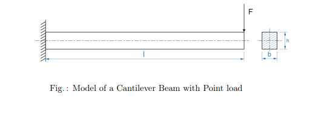
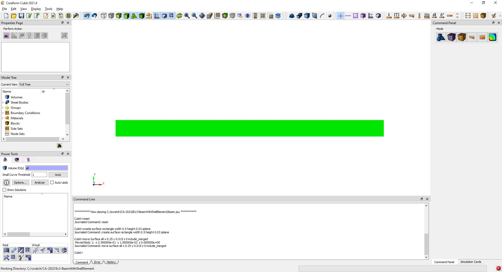
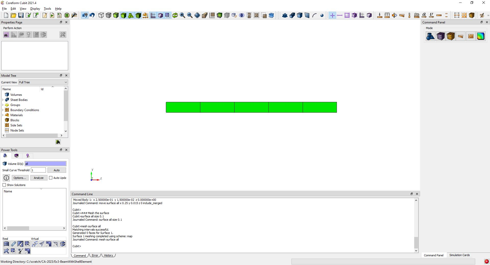
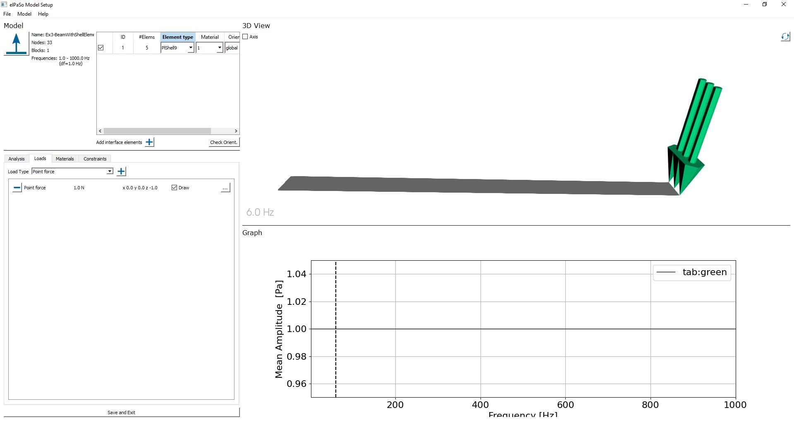
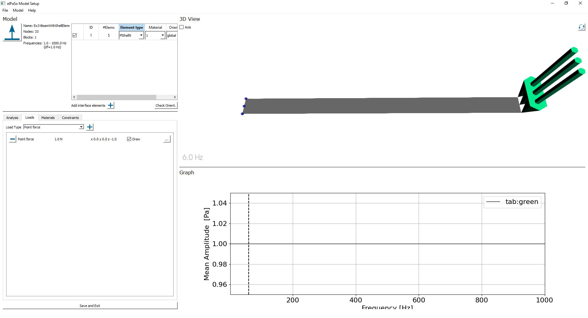
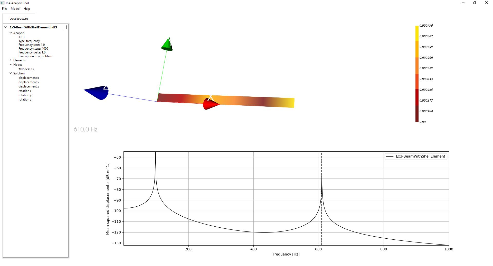
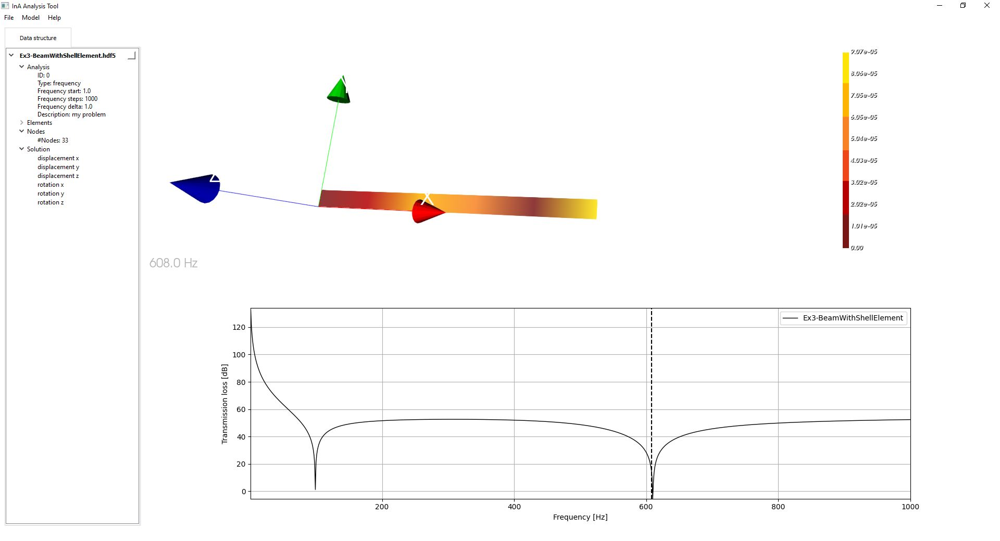
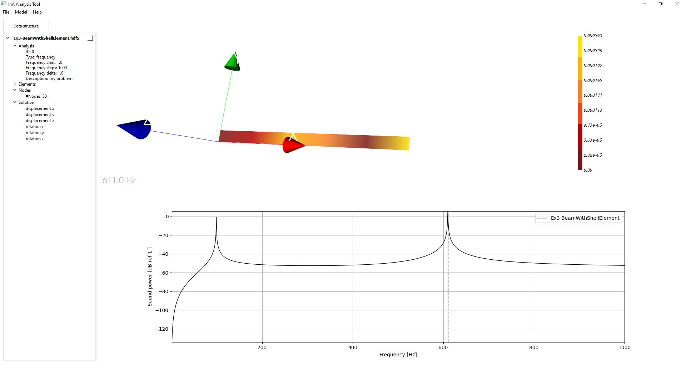

# Frequency Domain Analysis of Cantilever Beam using SHELL Elements

{bdg-primary}`required | Coreform Cubit` {bdg-primary}`required | elPaSo Pre-/Post-processor` {bdg-primary}`required | elPaSo Research Module`

{bdg-info}`keywords` {bdg-info-line}`Beginner` {bdg-info-line}`FEM` {bdg-info-line}`PlShell9` {bdg-info-line}`Shell` {bdg-info-line}`Frequency-domain`

## Objective 
Assume a simply supported beam with length l and cross section bxh made of Aluminium, a linear elastic isotropic material, as shown in figure. Model and geometry parameters are given in table below. A force of 1N is applied at the other end. The aim is to find the mean squared velocity, transmission loss (Rayleigh) and sound power using SHELL Elements: PlShell9. 


 
|    Parameter          |   Symbol      |  Value                |
| :------------         | ------------- | :-------------        |
|Beam length            |$\text{l}   $  |$0.5 \text{ m }$       | 
|Beam breadth           |$\text{b}  $   |$0.03 \text{ m }$       |
|Beam height            |$\text{h} $    |$0.03 \text{ m }$       |
|Force                  |$\text{F }$    |$1 \text{ N }$         |
|Density                |$\rho$            |$2700$ $kg/m^3$        |
|Young’s modulus        |$\text{E}  $   |$7e10$ $N/m^2$         |
|Poisson’s ratio        |$\nu$    |$0.3$                 |
|frequency range        |$\text{f}  $   |$1 − 1000 \text{ Hz} $ |
|frequency step size    |$∆\text{f} $   |$1 \text{ Hz}$        |

----

## Modelling 

### Pre-Processing with Cubit Coreform and elPaSo Pre-Processor 

(label:BeamGeo)=
#### Modeling Of Geometry
The approach followed here is to create a plate first and then to specify the thickness which makes it a 3-D structure. 
* Firstly, the rectangular section in x-direction, that is of dimension $l \times h$, is created. \
**Follow the steps :  clicking on the Geometry button (Command Panel) > Surfaces > Create Surfaces > Rectangle > Specify Width and Height.** 
`````{admonition} Journal Script
:class: tip
<tt>#creating geometry\
create surface rectangle width 0.5 height 0.03 zplane  </tt> 
`````
* Now move the surface so as to set the origin: 
`````{admonition} Journal Script
:class: tip
<tt>#Move\
move Surface all x 0.25 y 0.015 z 0 include_merged</tt> 
`````



#### Meshing
After our basic geometry is modelled, we proceed to the meshing. \
The chosen mesh size is 0.1. \
**Follow: Mesh Button > Define Intervals and Sizes > Select: Approximate Size as 0.1 > Apply > Mesh**
`````{admonition} Journal Script
:class: tip
<tt>#Meshing\
surface 1 size 0.1 \
mesh surface 1</tt> 
`````




Blocks are now created for assigning element type and further application of BCs. \
**Follow: Analysis Groups and Materials button > Blocks > Manage Blocks > Select: Add > Set Block ID:1 > Face > Select all Faces/ ID(s): "all" > Apply** 
`````{admonition} Journal Script
:class: tip
<tt>#Blocks\
block 1 add face all </tt>
`````

Description of element type: \
Element type for the beam is now set as SHELL9. \
 **Follow: Analysis Groups and Materials button > Blocks > Manage Blocks > Select: Element Type > Select Corresponding Block ID > Surfaces > Set: SHELL9 > Apply** 
`````{admonition} Journal Script 
:class: tip
<tt>#Blocks \
block 1 element type SHELL9</tt>
````` 

#### Create nodesets

We require two nodesets: (1) for setting the load and (2) for setting the fixed boundary condition. Create a nodeset by clicking on  (Analysis Groups and Materials) >  (Nodesets) >  (Create nodesets) > ‘Nodeset ID’ (1) > ‘Select’ (Curve) > ‘ID(s)’ (all) > ‘Apply’

`````{admonition} Journal Script 
:class: tip
<tt>#Load and BC \
nodeset 1 add node all in curve 4 # loaded edge \
nodeset 2 add node all in curve 2 # fixed edge</tt>
`````    

#### Export as *.cub5 file

After creating the geometrical model the user now have to export the specifications to the elPaSo Pre-Processor to proceed with the next Pre-Processing steps. This can be done by clicking in the menu bar on ‘File’ > ‘Save’ > ‘Data type’ (Cubit files(*.cub5)) > Type in a remarkable name > ‘Save’

#### Analysis and mesh settings
* Now, the Pre-Processing routine will be continued in the elPaSo Pre-Processor. Therefore, the elPaSo Pre-Processor can be called via the command line:
```bash
python3 <path_to_preprocessor_codes>/main.py
```
* If the elPaSo Pre-Processor is opened, the user needs to load the *cub5 file, which is intuitively realized in the prompted Explorer-GUI.
* In `Model` space: The user needs to select the elPaSo-specific Element type 'PlShell9' in 'Element type'.
* In `Analysis` tab: The frequency range of the analysis has to be defined as below for `1-1000` Hz frequency range with 1 Hz frequency interval:
    - Start [Hz]: 1 Hz
    - Steps: 1000
    - Delta [Hz]: 1

#### External loads
* Change to `Loads` tab.
* A Force F = 1N in the negative z-direction (remember that the geometry is in z-plane) is to be applied at the required node. Go to `Loads` tab and a `Point force` to nodeset 1 (which is the loaded node we defined in Coreform).
* After creating the external load, the load vector can be displayed by checking on 'Draw'.



#### Material
* Change to `Materials` tab.
* The material can be added by choosing the 'Material Type' as `STRUCT linear elastic iso`.
* Furthermore, the material can be named (here, Aluminium) as well as defined by its different properties defined in the problem table above by providing values for E, nu, rho, t.
```{warning} 
Also the plate's thickness has to be set in 'Edit Material' (here: 0.03)
```
#### Boundary Conditions (BCs)
* Change to `Constraints` tab.
* For fixed boundary, choose `BC | Structure | Fieldvalue` as the Constraint Type and click add.
* Fix all degrees of freedom and apply to nodeset 2 (which is the boundary node we defined in Coreform)



#### Export as *.hdf5 file
* The export as an *.hdf5 file is realised by clicking on 'Save and Exit'


### Pre-Processing with Abaqus
```{warning} 
Under construction. Content will be available soon.
```
----

## Solving 
After completing the pre-Processing routine, the user can call elPaSo via the terminal (elpasoC must be callable!):
```bash
elpasoC -c -inp <filename>.hdf5
```
A successful solving would lead to generation of output files (eGenOutput*.hdf5 when for hdf5 output or *.vtk files for vtk output) with the solutions. You may also check the `*.log.0` file for the elPaSo run logs.

## Post-Processing

After having solved for primary variables, one need to do Post-Processing to calculate derived variables and visualize the results. Post-processing is done for every frequency step.

* Therefore, the user has to open the elPaSo Post-Processor via the command line:
```bash
python3 <path_to_preprocessor_codes>/mainAnalysis.py
```
* Following this, the user has to load the model into the elPaSo Post-Processor by clicking on 'Model' > 'Load Model' in the Menu Bar
```{warning} 
Please load the initial *.hdf5 file, not the eGenOutput_<filename>.*hdf5 file!
```
* Finally, the user may want to compute the frequency response function for the mean squared velocity, transmission loss (Rayleigh) and sound power by clicking on 'Solution' > right click on 'displacement z' > 'Mean squared velocity/Transmission loss/Radiated sound power' > tick 'Block 1' > 'OK'

* Mean squared velocity:\


* Transmission loss:\


* Radiated sound power:\


----

## Conclusion

The tutorial presented modelling of a beam by using SHELL elements. We did the computation with elPaSo and performed post-processing for mean squared velocity, transmission loss (Rayleigh) and sound power.
 

 